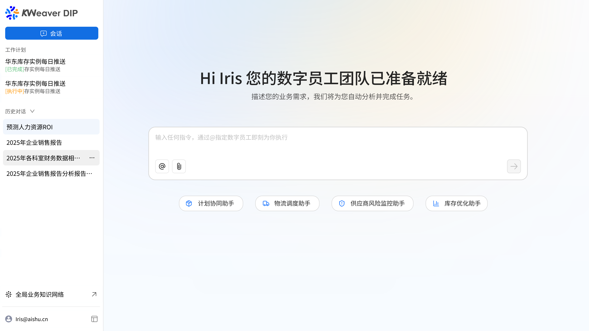

# Get to Know the KWeaver DIP Interface

## 1. Overall Layout Overview

After you enter the system, the interface mainly consists of the following two parts:

- Left side: navigation bar (feature entry points)
- Center: core workspace (AI interaction and task entry points)

---

## 2. Navigation Bar

The left navigation bar provides the core entry points of the system and helps you quickly access different modules.

### Conversation

Used to interact with Digital Workers. This is the core entry point of the system.

- Supports entering business requirements
- Automatically generates tasks or solutions
- Stores all AI interaction history

---

### Work Plan

Used to display the execution status of the current Digital Worker tasks.

Current example:

- Per-minute storage monitoring (paused)

Description:

- Displays tasks created automatically or manually by the system
- Supports viewing runtime status such as running, paused, and completed

---

### History

Used to view past execution records or conversation content.

- Supports tracing task origins
- Reuses historical inputs
- Helps with troubleshooting and review

---

### Global Business Knowledge Network

Used to manage the enterprise knowledge system:

- Knowledge accumulation
- Semantic association
- Support for AI business understanding

This is one of the core foundations of the system's intelligence.

---

## 3. Core Workspace (Center Area)

This is the main operating area of the system and is used to launch tasks and interact with AI.

---

### Welcome Area

The center of the page displays the following message:

<quote-container>
Your Digital Worker team is ready
</quote-container>

Description:

- The current system is available
- Users are encouraged to enter task requests

---

### Input Box

This is the most important interaction entry point.

Here you can:

- Enter business requirements, such as generating reports or analyzing data
- Trigger automatic tasks
- Invoke Digital Workers to execute work

Supported capabilities:

- Natural language input
- `@` invocation of capabilities or objects
- Attachment upload (`paperclip`)
- Quick send with the button on the right

In essence, this is a task-driven AI console.

---

## 4. Typical Usage Flow

It is recommended that new users start with the following workflow:

1. Describe your business requirement in the input box, for example `Generate a sales analysis report`.
2. The system parses the requirement and invokes a Digital Worker.
3. The system automatically generates a task or directly returns a result.
4. Check the execution status in **Work Plan**.
5. Find all conversations with the Digital Worker in **History**.

---

## 5. Interface Highlights

Compared with traditional systems, this interface has several obvious characteristics:

### Conversation as the Entry Point

It is task-driven rather than menu-driven.

### AI as the Operating System

Input becomes execution instead of requiring repeated clicks.

### Digital Workers as the Main Executors

Users do not operate the system directly. They direct the Digital Workers instead.

---

## 6. FAQ

**Q: Where should I start?**  
**A:** Directly enter your request in the center input box and `@` the target Digital Worker.

---

**Q: Where can I view tasks?**  
**A:** Check the execution status in **Work Plan**.
