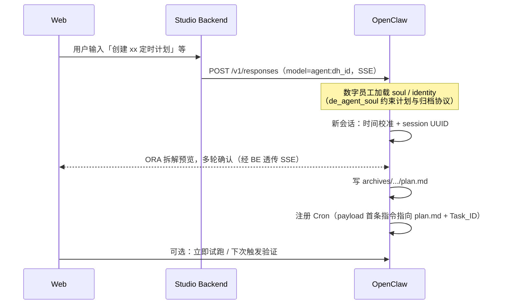
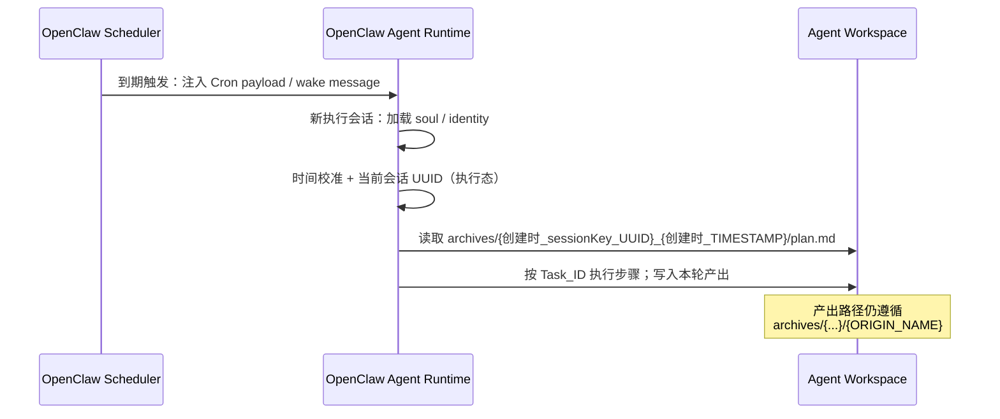

# 创建与执行计划（实现方案）

## 1. 目标与边界

**目标**：用户在 Web 侧为数字员工创建定时计划时，由 Agent 在 OpenClaw 工作区内完成 ORA 拆解与确认、将可执行细节写入 `plan.md`，并注册 Cron；触发执行时在**新会话**中按 `plan.md` 执行并把产出归档到约定目录。

**系统分工**：

| 组件 | 职责 |
|------|------|
| Studio Web | 发起对话、展示流式回复；可选展示计划列表与运行历史（经 BE 代理） |
| Studio Backend | 会话与 Agent 调用的 HTTP/SSE 转接；`cron.list` / `cron.runs` 查询；归档文件的 HTTP 代理（见 `sessions` 路由与 `openclaw-archives-http-client`） |
| OpenClaw | Agent 运行时、工作区文件、Cron 调度、网关 RPC（`cron.*`）与可选插件 `archives-access`（`GET /v1/archives/...`） |

**不在本文范围**：Cron 的创建/更新若完全由 Agent 在 OpenClaw 侧通过工具完成，则 Studio BE 当前以**只读**方式暴露 `cron.list` / `cron.runs`（见 `studio/src/routes/plan.ts`）；若产品要求从 Studio API 创建任务，需另增设计与接口。

---

## 2. 术语对齐

- **ORA**：Objective / Result / Action，与 `studio/templates/de_agent_soul.pug` 中 **[CORE_PROTOCOL]** 一致（文档中曾写的「ORD」应为 ORA）。
- **sessionKey_UUID**：从 `session_status`（或等价工具）返回的会话标识中解析出的 UUID 段，例如从 `agent:xxx:00000000-1111-...` 提取 `00000000-1111-...`。
- **TIMESTAMP**：写入归档前用 `date "+%Y-%m-%d %H:%M:%S"` 校准后格式化为目录名用的 `YYYY-MM-DD-HH-MM-SS`（与模板一致）。
- **归档根路径**（相对 Agent 工作区）：`archives/{sessionKey_UUID}_{TIMESTAMP}/`。
- **Task_ID**：`plan.md` 内每条计划条目的稳定标识（UUID），Cron 的 message 应指向「路径 + Task_ID」，便于同文件多任务共存。

---

## 3. 创建计划

### 3.1 时序（概念）

### 3.2 步骤说明

**0. 模板与灵魂文件**

- 每个数字员工的 `SOUL.md` 由 `studio/templates/de_agent_soul.pug` 生成，**强制**：ORA 确认流、归档路径、`plan.md` 内 `## Pending Schedules` 的维护方式、以及 Cron message 中「先读 `archives/{sessionKey_UUID}_{TIMESTAMP}/plan.md` 再执行」的表述。

**1. 启动会话并采集上下文**

- 加载 `soul.md`、`identity.md`（或项目中等价命名）。
- 执行时间校准（精确到秒），生成 `TIMESTAMP` 目录段。
- 调用会话状态工具，解析 **sessionKey_UUID**。

**2. ORA 拆解与用户确认**

- **O**：业务目标与与价值观对齐说明。
- **R**：可验收结果 / 交付物描述。
- **A**：频率、参数、执行步骤概要；**禁止**在未确认前直接创建 Cron。
- 多轮对话直到用户确认（或产品定义的明确确认动作）。

**3. 持久化 `plan.md`**

- 路径：`archives/{sessionKey_UUID}_{TIMESTAMP}/plan.md`（相对工作区根）。
- 在 `## Pending Schedules`（或模板约定章节）追加/更新条目，包含 **Task_ID**、ORA 详情、`Archive_Path`、`Status` 等（参见模板中的写入规范示例）。
- 同一次「计划创建」会话内，`sessionKey_UUID` 与 `TIMESTAMP` 应与步骤 1 一致，避免 Cron 指向错误目录。

**4. 创建定时任务（OpenClaw Cron）**

- `sessionKey` / `agentId` 与当前数字员工一致（与 `OpenClawCronJob` 字段语义对齐）。
- **Cron 的 message（或等价 payload）首条指令**须可机读地包含：
  - `plan.md` 的归档相对路径；
  - `Task_ID`；
  - 要求 Agent **先读取**该文件对应条目再逐步执行（与 `de_agent_soul.pug` 中 Action 条款一致）。

**5. 验证**

- **试跑**：由用户或运维触发一次与 Cron 等价的最小消息，检查是否读取同一 `plan.md` 条目并写入预期归档物。
- **观测**：通过 Studio 已提供的计划/运行查询接口观察 `cron.runs`（若网关返回）是否与预期 session 关联。

---

## 4. 执行计划

### 4.1 时序（概念）

### 4.2 步骤说明

1. **调度**：由 OpenClaw 内部 Cron 在到期时向指定 `agentId` / `sessionTarget` 投递任务（具体字段以网关实现为准）。
2. **新会话执行**：执行轮次通常与「创建计划时的聊天会话」不同，因此 **不得依赖聊天上下文**；唯一可信来源为 Cron 消息中携带的路径 + `Task_ID` 与磁盘上的 `plan.md`。
3. **读取与执行**：解析 `plan.md` 中对应 **Task_ID** 的 Action_Steps，逐步执行（含权限自检、读取本文件、业务动作、归档校验——与模板一致）。
4. **归档物**：本轮产生的文件写入**同一套** `archives/{sessionKey_UUID}_{TIMESTAMP}/` 目录（或与产品约定下的子目录），便于 Studio 通过 `session` 前缀列举与下载（见下文）。

---

## 5. 归档物管理

### 5.1 目录与命名

- **根约定**：`archives/{sessionKey_UUID}_{TIMESTAMP}/`。
- **计划文件**：该目录下 `plan.md` 为「创建计划」会话写入的权威步骤；执行轮次只追加运行产物，避免覆盖 `plan.md` 除非产品明确允许「版本化更新」。
- **运行产物**：报告、日志摘要、导出文件等，文件名使用可读 `ORIGIN_NAME`；避免 `..` 与绝对路径，遵循 OpenClaw 工作区沙箱。

### 5.2 与 Cron 的绑定关系

- Cron 中应同时能定位：**创建时的** `{sessionKey_UUID}_{TIMESTAMP}` 与 **Task_ID**。
- 若同一 Cron 后续需要「迁移」到新版本计划，产品需定义：新 `plan.md` 路径 + 任务切换策略（保留旧目录只读或废弃标记）。

### 5.3 Studio 侧能力（已实现方向）

- **HTTP 代理读取归档**：`GET /api/dip-studio/v1/digital-human/:dh_id/sessions/:session_id/archives/*subpath` 将请求转到网关的 `/v1/archives/...`（需网关启用 `archives-access` 并配置 token），用于 Web 预览或下载。
- **按 session 过滤列举**：插件支持 `session` 查询参数过滤目录前缀，便于列出某次计划相关的 `sessionKey_UUID_*` 文件夹（参见 `studio/extensions/archives-access/README.md`）。
