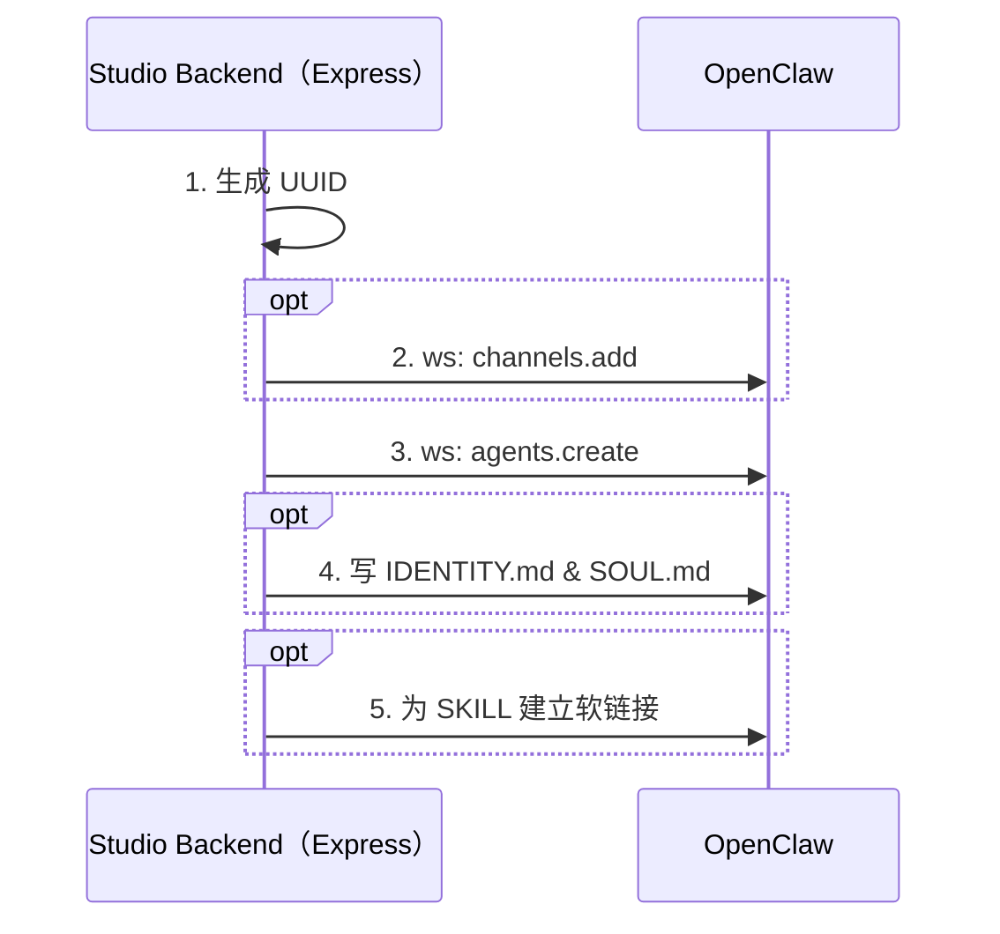

# 创建新的数字员工

## 业务流程

### 创建数字员工 Logic

1、生成 UUID
后端服务首先需要生成一个数字员工的 UUID。UUID 有两种来源： 
1. 通过参数传入 UUID；
2. 如果参数没有指定 UUID，则随机生成一个。

2、（可选）创建 channel

如果用户传递了 `channel` 参数，则通过 OpenClaw 的 WebSocket RPC 执行 `channels.add` method，参考：@docs/references/openclaw-websocket-rpc.md。

3、创建 Agent
通过 OpenClaw 的 WebSocket RPC 执行 `agents.create` method，参考：@docs/references/openclaw-websocket-rpc.md。

4、写 IDENTITY.md 和 SOUL.md

在 <OPENCLAW_WORKSPACE_DIR>/<UUID> 对应的目录下更新 IDENTITY.md 和  SOUL.md

5、为 Skill 建立软链接
根据 Skill 的名字在 `<OPENCLAW_WORKSPACE_DIR>/__internal_skill_agent__/skill-store/` 下找到对应的技能文件夹，然后建立软链接到  `<OPENCLAW_WORKSPACE_DIR>/{UUID}/skills/` 目录下。
注意：`skills[]` 参数是全量的技能名称，skills 目录下的软链接必须和 `skills[]` 参数保持一致。

### 通过接口创建数字员工
提供 HTTP 接口来创建数字员工。
- endpoint: POST  /dip-studio/v1/digital-human